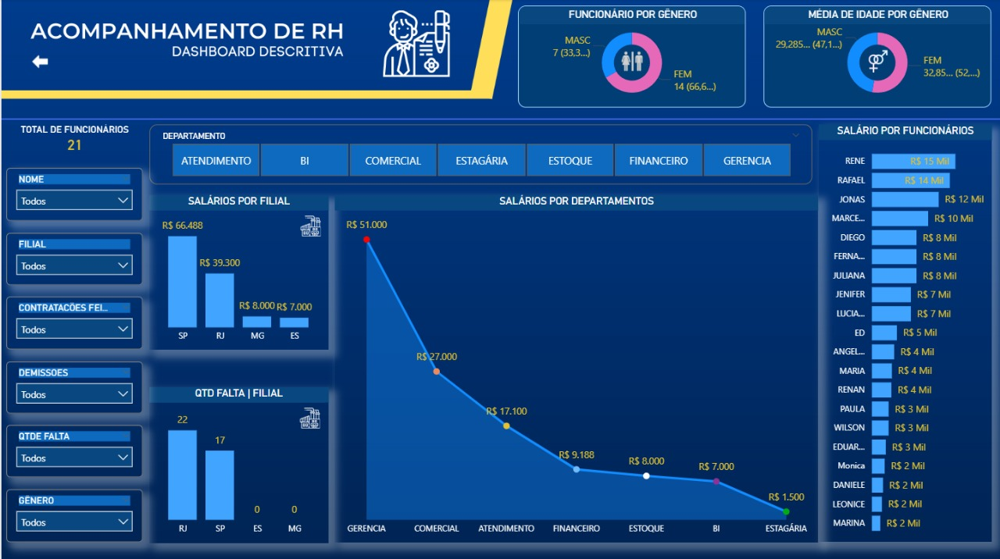

# 📊 Dashboard de Acompanhamento de RH – Power BI Stater

Este repositório contém um projeto desenvolvido durante o curso **Aprendendo Power BI na prática + SQLServer + Criação de Interface para Dashboard com FIGMA** (Udemy).  
O objetivo é demonstrar conhecimentos essenciais de análise de dados, modelagem simples e criação de medidas DAX, aplicados em um dashboard funcional de **Acompanhamento de Recursos Humanos**.

---

## 🧠 Objetivos do Projeto
- Construir um relatório simples e funcional no Power BI  
- Criar medidas básicas em DAX  
- Aplicar boas práticas de formatação e visualização  
- Demonstrar capacidade de transformar dados em insights

---

## 📸 Prévia do Dashboard

---

## 🛠️ Tecnologias e Ferramentas
- **Power BI Desktop**
- **DAX (medidas básicas)**
- **Modelo de dados simples**
- **Ferramentas de visualização padrão**

---

## 📈 Principais Indicadores Criados
- Total de funcionários  
- Taxa de turnover  
- Entradas e saídas por período  
- Distribuição por setor  
- Distribuição por gênero  

---

## 📘 Aprendizados Importantes
- Importação e tratamento inicial de dados  
- Construção de medidas em DAX
- Montagem de página única com foco em clareza  
- Aplicação de layout visual coerente  
- Publicação no GitHub para portfólio profissional

---

## 🚀 Sobre Mim
**Clarisse Maurila**  
Atualmente em transição/expansão para análise de dados.

📌 *Esse repositório faz parte do meu portfólio profissional.*  
